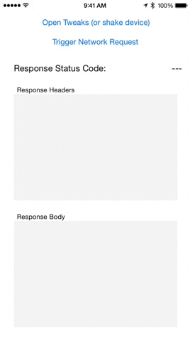
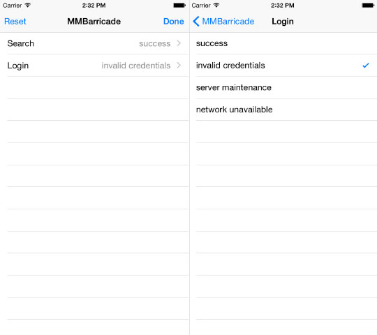

# MMBarricade

[](http://cocoadocs.org/docsets/MMBarricade)
[](http://cocoadocs.org/docsets/MMBarricade)
[](https://travis-ci.org/mutualmobile/MMBarricade)

## Why Barricade?

MMBarricade is a framework for setting up a run-time configurable local server in iOS apps. This works by creating a NSURLProtocol "barricade" that blocks outgoing network traffic and redirects it to a custom, local response, without requiring any changes to existing networking code. 

`NSURLSession`, `NSURLConnection`, `AFNetworking`, and all other networking that utilizes Foundation's [URL Loading System](https://developer.apple.com/library/mac/#documentation/Cocoa/Conceptual/URLLoadingSystem/URLLoadingSystem.html#//apple_ref/doc/uid/10000165i) are supported.

Most other local server implementations only support a single response per request, but Barricade supports multiple responses per request. This allows us to present the user with an interface for modifying which response will be returned for a request at runtime.

<p align="center">

</p>


## When to use 

During **development** barricade is useful for easily exercising all edge cases of a feature while you are building it without needing to frequently adjust the live server state.

For **unit tests and integration tests** barricade allows you to easily toggle through each predefined response for a request so tests can cover edge cases thoroughly.

Similarly, **UI tests**, such as [KIF](https://github.com/kif-framework/KIF), can programmatically update selected responses as well, which allows your test suite to cover failure cases as well as the "happy path".

Take a look at the unit tests in `MMBarricadeTests.m` of `DevelopmentApp/Barricade.xcworkspace` for several examples of how unit tests can be implemented utilizing Barricade.


##Installing MMBarricade
<br/>
The easiest way to install MMBarricade is with [CocoaPods](https://github.com/cocoapods/cocoapods):

```Ruby
pod 'MMBarricade', '~> 1.0.0'
```

## Overview

Barricade's functionality is based around four primary classes: `MMBarricade`, `MMBarricadeResponse`, `MMBarricadeResponseSet` and `<MMBarricadeResponseStore>`.

**MMBarricade**

`MMBarricade` is a [NSURLProtocol](https://developer.apple.com/library/prerelease/ios/documentation/Cocoa/Reference/Foundation/Classes/NSURLProtocol_Class/index.html) subclass and is the primary class to use when interacting with barricade. 

**MMBarricadeResponse**

An instance of `MMBarricadeResponse` defines a single response to an HTTP request. For example, a response might consist of an HTTP status code of 200, a content-type of "application/json" and a JSON object for the response data.

**MMBarricadeResponseSet**

An instance of `MMBarricadeResponseSet` represents a collection of possible responses for a single request. For example, a response set for the `/login` API endpoint might be a set of three responses representing Success, Invalid Credentials and Server Error.

**MMBarricadeResponseStore**

A response store conforms to `<MMBarricadeResponseStore>` and is responsible for managing the selection of which response should be returned for a network request out of the set of possible responses. This selection can be modified programmatically, or through the Tweaks UI (as seen in the gif above).

## Quick Start

First, import the library header file. If using Tweaks to manage user selections, import the Tweaks category to get access to the convenience initializer.

```objective-c
#import "MMBarricade.h"
```

Next, give the barricade a response store and enable it. Once enabled, the barricade will begin responding to network requests.

```objective-c
// Setup the barricade. This only needs to be done once.
[MMBarricade setupWithInMemoryResponseStore];
[MMBarricade enable];
```

In this example, we'll setup the barricade to be able to respond to the `/login` API endpoint with one of three possible responses. The "name" parameters for the response set and each individual response are user-facing strings used to identify the request and responses to the developer. They are displayed in the Tweaks UI, and can be used to programmatically udpate the selected response as well.

In this example, the response files are JSON-formatted text files stored on disk in a subdirectory of the app bundle named "LocalServer". There are no naming conventions that must be followed for file names.

```objective-c
// Create a response set for each API call that should be barricaded.
MMBarricadeResponseSet *responseSet = [MMBarricadeResponseSet responseSetForRequestName:@"Login" respondsToRequest:^BOOL(NSURLRequest *request, NSURLComponents *components) {
   return [components.path hasSuffix:@"/login"];
}];
    
// Add Successful response
[responseSet addResponseWithName:@"Success"
                           file:MMPathForFileInMainBundleDirectory(@"login.success.json", @"LocalServer")
                     statusCode:200
                    contentType:@"application/json"];
    
// Add Invalid Credentials response
[responseSet addResponseWithName:@"Invalid Credentials"
                           file:MMPathForFileInMainBundleDirectory(@"login.invalid.json", @"LocalServer")
                     statusCode:401
                    contentType:@"application/json"];

// Add No Network Connection response
[responseSet addResponseWithName:@"Offline"
                          error:[NSError errorWithDomain:NSURLErrorDomain
                                                    code:NSURLErrorNotConnectedToInternet
                                                userInfo:nil]];
    
// Register the response set
[MMBarricade registerResponseSet:responseSet];

```

By default, the first response added to a response set will be used to respond to the request. However, the selected response can be modified through the Tweaks interface or programmatically. In either case, the "name" parameters specified when creating the responses are used to identify the desired response.

```objective-c
[MMBarricade selectResponseForRequest:@"Login" withName:@"Offline"];
```

## Selection Interface

Barricade comes with an in-app interface that can be presented to allow selection of network responses at runtime. 

<p align="center">

</p>

There are two approaches you can take for presenting the selection UI:

- Automatically present the interface when the device is shaken. To do this, just replace your `UIWindow` with an instance of an `MMBarricadeShakeWindow`. If you're using storyboards, override `- window` in your app delegate:

```objective-c
- (UIWindow *)window {
    if (!_window) {
        _window = [[MMBarricadeShakeWindow alloc] initWithFrame:[[UIScreen mainScreen] bounds]];
    }    
    return _window;
}
```

*Note: By default the shake window is presented for Debug builds only. You can override the `MMBARRICADE_SHAKE_ENABLED` macro to adjust this behavior.*

- Manually present a `MMBarricadeViewController` at any time in your app, just be sure to limit the presetation to debug builds if you don't want it to ship to the App Store.

## Tweaks

If you are using [Facebook Tweaks](https://github.com/facebook/Tweaks) in your app, you can use the Tweaks subspec of Barricade to integrate the in-app selection interface inside of Tweaks.

```
pod 'MMBarricade/Tweaks', '~> 1.0.0'
```

The only other change you need to make is to setup the barricade using a tweaks response store rather than the in-memory response store:

```objective-c
#import "MMBarricade+Tweaks.h"
...
[MMBarricade setupWithTweaksResponseStore];
[MMBarricade enable];
```

## App Store Submission

MMBarricade is safe to include with App Store builds (and could be used to support things like a demo mode for your app), but most of the time you will probably want to ensure that the barricade is disabled for App Store builds. Here are a couple of approaches:

**Conditionally enable**

In your app, you can wrap the creation of the barricade inside a macro to limit the code execution to particular build configurations. For example:

```objective-c
#if DEBUG
[MMBarricade enable];
#endif
```

**Disable through CocoaPods**

When installing through CocoaPods, you can specify particular build configurations to limit the installation of the library. For example:

```objective-c
pod 'MMBarricade', '~> 1.0.0', :configurations => ['Debug']
```

Or, if you are only utilizing the library for unit tests, you may want to link the library with only your testing target:

```objective-c
target 'Tests', :exclusive => true do
  pod 'MMBarricade', '~> 1.0.0'
end
```


## Advanced Configuration

Configuration consists of two steps:

1. Setup a response store
2. Enable the barricade

The barricade must be configured with an instance of an `<MMBarricadeResponseStore>` before it can be used. To use one of the included response stores, you can:

```objective-c
[MMBarricade setupWithTweaksResponseStore];
-or-
[MMBarricade setupWithInMemoryResponseStore];
```

Once the backing store for the barricade is setup, it should be enabled. Because the barricade works as a [NSURLProtocol](https://developer.apple.com/library/prerelease/ios/documentation/Cocoa/Reference/Foundation/Classes/NSURLProtocol_Class/index.html) subclass, the way to enable it differs depending on how you will be making network requests in your app.

**NSURLConnection**

For networking based on the older networking style of NSURLConnection-based requests, simply calling `[MMBarricade enable]` will register the NSURLProtocol for you.

**NSURLSession**

For networking based on the newer NSURLSession-based APIs, you have two options:

If you are using `[NSURLSession sharedSession]`, then you can enable with `[MMBarricade enable]`.

If you are creating a custom session, for example `[NSURLSession sessionWithConfiguration:configuration]`, then you should enable the barricade with your custom session configuration before creating the session.

```objective-c
NSURLSessionConfiguration *configuration = [self myCustomSessionConfiguration];
[MMBarricade enableForSessionConfiguration:configuration];
NSURLSession *session = [NSURLSession sessionWithConfiguration:configuration];
...
```


### Changing the response

The response that will be returned by the barricade when a request is made is the "current response" that has been selected in the `MMBarricadeResponseSet` for the request. In addition to updating the current response through the tweaks UI, the response can also be updated programmatically:

```objective-c
[MMBarricade selectResponseForRequest:@"login" withName:@"offline"];
```


## Requirements

MMBarricade requires iOS 7.0 or higher.


## Credits

MMBarricade was created by [John McIntosh](http://twitter.com/johntmcintosh) at [Mutual Mobile](http://www.mutualmobile.com).

Credit also to [Justin Kolb](https://github.com/jkolb) for pioneering the concept of run-time adjustable network responses and [Conrad Stoll](http://twitter.com/conradstoll) for feedback.

## License

MMBarricade is available under the MIT license. See the LICENSE file for more info.
